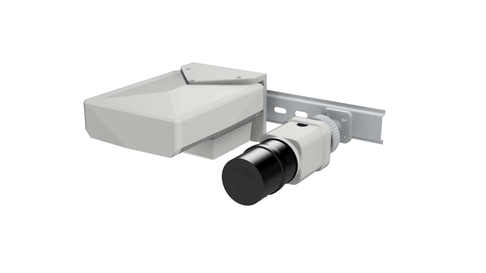

# Waterproof Jetson Orin & FLIR Firefly Enclosure 🌊📷

An industrial, fully weatherproof enclosure designed to house an Nvidia Jetson Orin compute board paired with a Tamron lens and FLIR Firefly camera sensor. Features active thermal management, articulated pivot arms, dedicated sealing gaskets, and a snap-on DIN rail interface.

## 📌 Key Engineering Features

* **Complete Sealing Protection:** Uses dedicated 3D-printed TPU gaskets including a **Main Enclosure Gasket**, a **Sensor Camera Gasket** for the FLIR lens module, and a **Sensor Wire Gasket** to seal the cable entry into the FLIR sensor.
* **Articulated Pivot Mount:** Adjustable **Pivot Arms** coupled with a **T-Mount Plate** allowing precise pan-and-tilt aiming of the sensor assembly.
* **DIN Rail Mounting:** The T-Mount Plate secures directly into a **DIN Rail Clip** that snaps onto standard 35mm (IEC 60715) industrial mounting rails.
* **Active Thermal Venting:** Integrated housing for the Jetson Orin's stock heatsink and fan with steeply angled 70° louvers to block rain ingress during active airflow.
* **Passive Water Drainage:** Banked interior flooring (10°–15°) with drip channels directing condensation safely away from core electronics.

---

## 🛠️ Bill of Materials (BOM)

### 3D Printed Parts
| Part | Qty | Material | Function |
| :--- | :---: | :--- | :--- |
| Main Enclosure Body | 1 | ASA / PETG | Primary weatherproof housing |
| Main Enclosure Gasket | 1 | TPU (85A–95A) | Tongue-and-groove enclosure seal |
| Sensor Camera Gasket | 1 | TPU (85A–95A) | Weatherproof seal for FLIR camera housing |
| Sensor Wire Gasket | 1 | TPU (85A–95A) | Cable pass-through gasket for FLIR wiring |
| Pivot Arms | 1 | PETG-CF / ASA | Articulated positioning arms |
| T-Mount Plate | 1 | PETG-CF / ASA | Interface between Pivot Arms and DIN clip |
| DIN Rail Clip | 2 | PETG-CF / ASA | Snaps onto 35mm DIN rail |

### Hardware & Fasteners
| Fastener / Part | Qty | Description & Supplier Link |
| :--- | :---: | :--- |
| **M4 x 25mm Hex Bolts** | 25 | [M4 x 25mm Hex Bolt SS304 (OnlyScrews)](https://onlyscrews.in/products/m4-x-30mm-hex-allen-socket-head-ss-304-screw) |
| **M4 Hex Nuts** | 25 | [M4 Hex Nut SS304 (OnlyScrews)](https://onlyscrews.in/products/m4-nut-ss-304) |
| **M4 Heat-Set Inserts** | 12 | Brass M4 heated inserts for mounting standoffs |

---

## 🔧 Assembly Sequence

1. **FLIR Sensor & Camera Assembly:**
   * Fit the **Sensor Camera Gasket** onto the housing rim and secure the FLIR Firefly camera sensor and Tamron lens inside `Camera_Housing.stl`.
   * Pass the FLIR wiring harness through the **Sensor Wire Gasket** to establish a watertight cable entry point before closing with `Camera_Bottom_Cap.stl`.

2. **Articulation & Mount Integration:**
   * Assemble the **Pivot Arms** to the camera housing using M4 x 25mm hex bolts and M4 nuts.
   * Attach the **T-Mount Plate** to the end of the Pivot Arms.
   * Secure the **T-Mount Plate** into the **DIN Rail Clip**.

3. **Internal Electronics Installation:**
   * Press the  **M4 Brass Heat-Set Inserts** into the internal mounting bosses of `Enclosure_Bottom_Housing.stl` using a soldering iron.
   * Secure the Jetson Orin compute unit onto the bottom standoffs using M4 bolts.

4. **Main Enclosure Sealing & Mounting:**
   * Press the **Main Enclosure Gasket** into the perimeter channel of `Enclosure_Bottom_Housing.stl`.
   * Align `Enclosure_Top_Cover.stl` and tighten down the outer M4 x 25mm hex bolts and nuts evenly in a cross pattern to compress the gasket.
   * Snap the assembled **DIN Rail Clip** directly onto your 35mm DIN rail.

## 🖨️ 3D Printing Recommendations

To guarantee structural strength, UV resistance, and true watertight integrity, use these tuned slicer settings based on component material:

| Setting | Rigid Components (ASA / PETG-CF) | Flexible Seals (TPU 85A–95A) |
| :--- | :--- | :--- |
| **Target Components** | Body, Cover, Camera Housing, Pivot Arms, DIN Clip | Main Gasket, Camera Gasket, Wire Gasket |
| **Layer Height** | 0.20 mm | 0.16 mm – 0.20 mm |
| **Wall Loops / Perimeters** | 4 – 5 walls | 100% Solid (or 4+ perimeters) |
| **Top / Bottom Layers** | 5 Top / 5 Bottom | 5 Top / 5 Bottom |
| **Infill** | 35 - 40% (Gyroid pattern) |

---

### 💧 Watertight Printing & Post-Processing Tips

* **Solid Perimeter Gaskets:** Always print TPU gaskets with 100% solid walls and infill. Internal voids or lower infill settings in TPU can allow water to capillary-bleed along layer lines under pressure.
* **Sealing FDM Layer Lines:** For extreme weather conditions, brush a thin coat of UV-resistant epoxy resin or clear polyurethane finish over the exterior surfaces of the ASA/PETG housing to completely seal micro-gaps between layer lines.
* **Extruder Setup:** Print TPU on a direct-drive extruder (if possible) at slow, consistent speeds (20–30 mm/s) to avoid binding in the feed gear and to ensure smooth perimeter walls on gasket mating faces.
